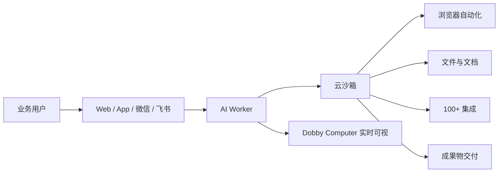

# Dobby 企业推广幻灯片内容

> 适用场景：面向企业客户的销售演示、商务洽谈、试点提案  
> 产品：https://www.dobby.now · 中文企业页：https://www.dobby.now/cn/enterprise  
> 联系：support@dobby.now

---

## 目录

| # | Slide | Purpose |
|---|--------|---------|
| 1 | Cover | Brand + positioning |
| 2 | Executive summary | 30-second pitch |
| 3 | Enterprise pain | Why now |
| 4 | What is Dobby | Category definition |
| 5 | How it works | Architecture / flow |
| 6 | Core capabilities | Product depth |
| 7 | Dobby Computer | Trust & visibility |
| 8 | Use cases by department | Business relevance |
| 9 | Integrations & automation | Connect to existing stack |
| 10 | Multi-channel access | Adoption & China readiness |
| 11 | Time-to-value | Pilot → scale |
| 12 | Security & governance | IT concerns (honest framing) |
| 13 | Packaging & pricing | Commercial path |
| 14 | Why Dobby vs alternatives | Differentiation |
| 15 | Pilot proposal | Concrete next step |
| 16 | Call to action | Close |

**建议格式：** 16:9，深色或简洁白底，第 5–7、10 页配产品截图。

---

## Slide 1 — Cover

**Title:** Dobby  
**Subtitle:** 为团队部署可执行的 AI Worker  
**Tagline:** 云端托管 · 真实执行 · 中文原生 · 企业可试点  

**Footer:** dobby.now | support@dobby.now  

**Speaker notes:**  
开场一句话：*「Dobby 不是聊天机器人，而是能在云端沙箱里真正干活的 AI 员工。」*

---

## Slide 2 — Executive summary

**Headline:** 从「问 AI」到「让 AI 交付结果」

**Bullets:**

- **自主执行**：浏览网页、处理文件、调用集成、生成文档/演示文稿/数据报告
- **零基础设施**：无需自建 Gateway、沙箱或模型路由，注册即用
- **可配置 Worker**：按销售、运营、研究、客服等场景定制智能体
- **7×24 自动化**：定时任务 + 事件触发（邮件、表单等）
- **统一用量管理**：项目、线程、积分、订阅集中管控

**Speaker notes:**  
定位要区别于「只会回答问题的 Copilot」—— Dobby 产出可交付物并完成工作流。

---

## Slide 3 — 企业面临的挑战

**Headline:** AI 试点常见卡点

| 痛点 | 现状 |
|------|------|
| 只会聊，不会干 | 通用 ChatGPT 无法操作业务系统、产出可交付文件 |
| 自建成本高 | OpenClaw / 自研 Agent 需 IT 维护 Gateway、频道、沙箱 |
| 集成碎片化 | 每个部门各自摸索 Prompt，无法连接 Gmail/Slack/Notion 等 |
| 缺乏可视化 | 黑盒执行，业务与 IT 难以审计和信任 |
| 国内落地难 | 中文体验、微信/支付宝、IM 触达缺失 |

**Speaker notes:**  
承认许多企业已试过 ChatGPT Enterprise 或内部 Bot—— 缺口在于 **执行能力 + 集成 + 运维负担**。

---

## Slide 4 — Dobby 是什么

**Headline:** 云端托管的自主 AI 员工平台

**One-liner:**  
在浏览器或微信/飞书里下达任务 → 在隔离云沙箱中真实执行 → 交付文档、表格、演示文稿、研究报告等成果物。

**对比心智模型:**

| | 传统 AI 助手 | Dobby |
|--|-------------|--------|
| 交互 | 对话 | 对话 + **执行** |
| 环境 | 无 | **Dobby Computer**（浏览器/文件/Shell） |
| 部署 | 各用各的 | **SaaS，天级试点** |
| 产出 | 文本回复 | **可下载文件、PPT、报告** |

**Speaker notes:**  
内部记忆口诀：*Dobby = 云端 AI 员工，带完整工位。*

---

## Slide 5 — 工作原理

**Headline:** 任务如何被完成

**Bullets:**

1. 用户描述任务或触发自动化规则
2. Worker 规划步骤并调用工具
3. 在隔离沙箱中执行（网页、文件、命令行）
4. 通过 Composio/MCP 连接企业应用
5. 业务方在 Dobby Computer 中实时查看进度

**Visual suggestion:** Dobby Computer 截图 + 已完成的 PPTX/PDF 产出物。

---

## Slide 6 — 核心能力

**Headline:** 一个平台，覆盖多种工作类型

| 能力 | 示例 |
|------|------|
| **研究分析** | 竞品调研、市场趋势、信息综合报告 |
| **浏览器自动化** | 填表、抓取、多步网页流程 |
| **文档与演示** | 提案、手册、培训材料、商务 PPT |
| **数据处理** | 表格清洗、图表、洞察报告 |
| **图像与视觉** | 营销素材、产品图、社交媒体图形 |
| **自定义 Worker** | 按部门配置人设、工具、知识库、集成权限 |

**Speaker notes:**  
对应产品 showcase 模式：研究 / 文档 / 数据 / 幻灯片 / 图像。

---

## Slide 7 — Dobby Computer：可审计的执行

**Headline:** 看得见、跟得上、拿得到

**Bullets:**

- **实时可视**：查看 Agent 在浏览器、文件、工具中的每一步
- **可交付产出**：PPTX、PDF、XLSX、代码、图像等可直接使用
- **Dedicated Computer**（Pro 及以上）：专属执行环境，适合高频/长任务
- **降低黑盒焦虑**：业务与 IT 可共同 review 执行过程

**Visual suggestion:** 并排展示：实时执行面板 + 导出的交付物。

**Speaker notes:**  
相对纯聊天或仅日志的 Agent，这是关键的企业差异化点。

---

## Slide 8 — 部门场景（Use Cases）

**Headline:** 典型企业应用场景

### 销售 / 市场

- 竞品与市场调研报告
- 客户提案、路演 PPT
- 营销素材与社媒内容批量生成

### 运营 / 产品

- 日报/周报自动生成与分发
- 表单/邮件事件触发跟进流程
- 流程文档、SOP、培训材料

### 研究 / 战略

- 行业扫描、政策追踪、多源信息综合
- 结构化竞品档案

### 客服 / 支持

- 知识库整理、FAQ 文档
- 工单摘要与回复草稿（配合集成）

### IT / 工程（轻量）

- 脚本辅助、文档生成、GitHub/Notion 联动
- 监控类定时任务（需评估权限边界）

**Speaker notes:**  
根据客户行业选 2–3 个场景深入展开；本页作为菜单。

---

## Slide 9 — 集成与自动化

**Headline:** 连接现有工具链，让 Worker 7×24 运行

**Integrations (100+ via Composio/MCP):**

- Gmail、Slack、GitHub、Notion、Google Sheets…
- 按 Worker 配置集成权限与可用工具

**Automation:**

| 类型 | 场景 |
|------|------|
| **定时触发** | 每日销售简报、每周竞品扫描 |
| **事件触发** | 新邮件、表单提交、外部系统事件 |
| **自定义 Worker** | 不同团队不同 Agent，独立工具集 |

**Speaker notes:**  
强调集成已产品化 —— 标准应用无需自写桥接代码。

---

## Slide 10 — 多端触达（含中国市场）

**Headline:** 业务同学在哪用，Dobby 就在哪

| 渠道 | 能力 |
|------|------|
| **Web 工作台** | 完整功能：项目、Worker 配置、账单、集成 |
| **iOS / Android** | 移动对话、查看结果 |
| **微信（iLink）** | 验证码绑定，微信内下达任务 |
| **飞书** | 企业 IM 绑定，适合国内企业协作习惯 |
| **Telegram** | 海外团队可选 |

**China-ready:**

- 完整简体中文 UI
- 支付宝 / 微信预付积分
- 无需 IT 自建 IM 桥接

**Speaker notes:**  
对国内企业，微信 + 飞书 + 支付宝往往是决定采纳的关键因素。

---

## Slide 11 — 快速落地路径

**Headline:** 天级试点，而非月级自建

| 阶段 | 时间 | 内容 |
|------|------|------|
| **Week 1** | 1–3 天 | 注册、Super Worker 试用、选 1 个高价值场景 |
| **Week 2** | 3–5 天 | 配置自定义 Worker + 1–2 个集成 |
| **Week 3–4** | 2 周 | 定时/事件自动化，小团队并行使用 |
| **Scale** | 按需 | 升级套餐、批量积分、发票/私有化讨论 |

**vs 自建 OpenClaw / 自研 Agent:**

| | Dobby | 自建 |
|--|-------|------|
| 部署 | SaaS | Gateway + VPS + 桥接 |
| 上线 | 天级 | 周级+ |
| 可视化 | Dobby Computer | 偏日志/聊天 |
| 运维 | 平台托管 | IT 自维护 |

---

## Slide 12 — 安全与治理（如实表述）

**Headline:** 企业 IT 关心的问题

**当前能力：**

- 任务在**隔离云沙箱**中执行
- 集成通过**授权凭证配置**，可按 Worker 限定工具
- 支持**私有项目**（Business 档及以上）
- 法务页含隐私政策、数据保留、GDPR 权利说明
- API 密钥采用公钥/私钥认证

**需商务沟通的事项（诚实披露）：**

- 数据为**云端托管**模式（非私有化部署）
- 大规模 SSO / 集中式企业管理员控制台 — 可作为**定制需求**讨论
- 渗透测试、专属 SLA、VPC/私有化 — 联系 **support@dobby.now**

**Speaker notes:**  
若无 SOC2 等认证，不要过度承诺。定位为「适合试点的 SaaS，大单可谈升级路径」。

---

## Slide 13 — 套餐与采购路径

**Headline:** 从试点到部门级使用

| 套餐 | 定位 | 关键能力 |
|------|------|----------|
| **Basic** | 试用 | 200 周积分，基础模式 |
| **Plus ($20/月)** | 小团队 | 2 万月积分、5 自定义 Worker、集成、定时/事件触发 |
| **Pro ($50/月)** | 成长型企业 | 5 万月积分、Dedicated Computer、20 Worker |
| **Ultra ($200/月)** | 重度用户 | 20 万月积分、更高并发与 Worker 上限 |
| **Business** | 成熟企业 | 私有项目、高级模型（联系商务） |

**企业采购选项：**

- 年付优惠（约 15%）
- **额外积分包**（不过期）
- **支付宝 / 微信预付**
- 发票、批量采购、部门试点包 — **support@dobby.now**

---

## Slide 14 — 为什么选 Dobby

**Headline:** 企业选型：Dobby vs 常见方案

| 维度 | Dobby | OpenClaw 自建 | 通用 ChatGPT |
|------|-------|---------------|--------------|
| 真实执行 | ✅ 云沙箱 | ⚠️ 需自建 | ❌ mainly chat |
| 上手速度 | ✅ 天级 | ❌ 周级+ | ✅ 快 |
| 集成 | ✅ 100+ 产品化 | ⚠️ 插件/MCP 自配 | ⚠️ 有限 |
| 可视化产出 | ✅ PPT/文件/报告 | ⚠️ 偏聊天/日志 | ⚠️ 文本为主 |
| 中国落地 | ✅ 中文/微信/支付宝 | ❌ 需自搭 | ⚠️ 部分支持 |
| 数据自控 | ⚠️ 云端 | ✅ 完全自管 | ⚠️ 云端 |

**Dobby 适合：** 需要**业务同学今天就能用**、以**交付结果**为导向、希望**少运维**的团队。

---

## Slide 15 — 建议试点方案（可定制）

**Headline:** 30 天企业试点建议

**目标：** 1 个部门、1 个 Worker、1 条自动化，验证 ROI

### Week 1 — 场景选定

- 选场景：如「每周竞品简报」或「销售提案初稿」
- 指定 3–5 名试点用户

### Week 2 — 配置与集成

- 创建部门 Worker（指令 + 工具 + 知识边界）
- 连接 1–2 个集成（如 Gmail + Notion）

### Week 3 — 自动化

- 配置定时触发（如每周一 9:00 生成报告）
- 收集产出质量反馈

### Week 4 — 评估

- 对比：耗时、质量、可复用性
- 决定是否扩展至更多 Worker / 更高套餐

**成功指标示例：**

- 单任务耗时 ↓ 60%+
- 每周可交付报告数 ↑
- 试点用户 NPS / 主观满意度

---

## Slide 16 — 下一步

**Headline:** 安排团队试点

**Primary CTA:** 团队免费试用 → https://www.dobby.now/auth  
**Enterprise CTA:** 联系商务 → support@dobby.now  

**我们可以提供：**

- 试点场景 workshop（30 min）
- Worker 配置最佳实践
- 发票 / 批量积分 / 私有化路线讨论

**Links:**

- 中文企业页：https://www.dobby.now/cn/enterprise
- 定价：https://www.dobby.now/pricing
- 教程：https://www.dobby.now/tutorials（含中文视频章节）

---

## Appendix A — 30 秒电梯演讲（中文）

> Dobby 是云端托管的 AI 员工平台。业务同学在 Web、微信或飞书里描述任务，Dobby 在隔离云沙箱里真实执行——查资料、写文档、做 PPT、连 Gmail 和 Notion、按 schedule 自动跑。相比自建 Agent，IT 不用维护基础设施；相比纯聊天 AI，Dobby 交付的是可用的文件和流程结果。适合先做小范围试点，再按部门扩展。

---

## Appendix B — Live demo script（10 分钟）

1. **登录 Web 工作台** — 展示中文界面
2. **Super Worker** — 「帮我做一份 [行业] 竞品分析，输出 PDF 报告」
3. **Dobby Computer** — 展示浏览器搜索、文件写入过程
4. **交付物** — 打开生成的 PDF / PPT
5. **自定义 Worker** — 展示销售/运营专用 Agent 配置
6. **集成** — 展示 Gmail 或 Notion 连接（如已配置）
7. **定时任务** — 展示 weekly report trigger
8. **微信/飞书**（可选）— 手机端下达同一类任务

---

## Appendix C — FAQ（备查页）

| 问题 | 建议回答 |
|------|----------|
| 数据存在哪？ | 云端托管账户与沙箱；私有化可商务讨论 |
| 能否接入飞书/微信？ | 可以，验证码绑定，无需自建桥接 |
| 和 Copilot 有何不同？ | Dobby 强调自主执行与可交付产出，非 IDE 内补全 |
| 如何控制成本？ | 积分制 + 套餐上限；可购不过期额外积分 |
| 能否开发票？ | 联系 support@dobby.now |
| 安全审计？ | 沙箱隔离 + 集成授权；大型合规需求单独评估 |

---

## Appendix D — English title slide（双语版可选）

**Title:** Dobby — Deploy Executable AI Workers for Your Team  
**Subtitle:** Hosted cloud agents that browse, integrate, automate, and deliver real work products — with a China-ready product surface.

---

## 相关文档

- [Dobby 产品概览与 OpenClaw 对比](./dobby-product-overview-and-openclaw-comparison.md)
- 中文企业落地页源码：`apps/frontend/src/components/landing/cn/cn-landing-content.ts`
